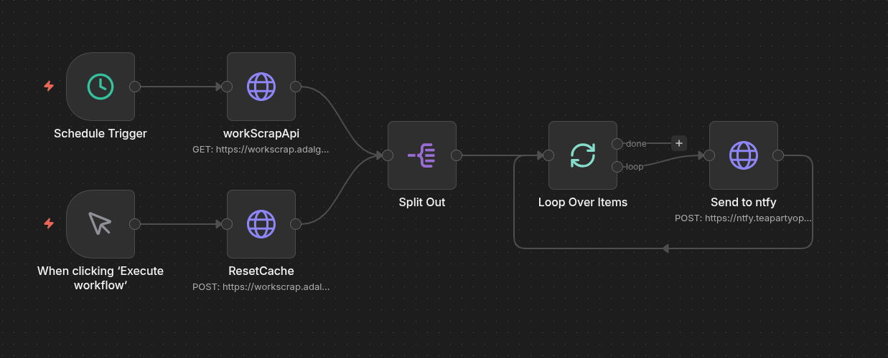
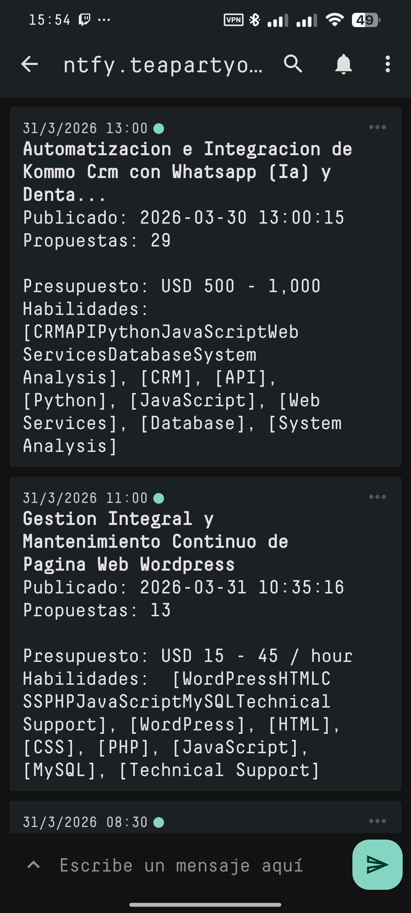

# Work Scrapping API

API para extraer y filtrar ofertas de trabajo desde múltiples plataformas de freelancing.

## Características

- Scraping automatizado con Playwright
- Filtros configurables por sitio (categorías, habilidades, fecha, presupuesto)
- Soporte multiidioma
- Cache en memoria con TTL configurable
- Autenticación por API Key para endpoints protegidos
- Servidor Express con CORS habilitado

## Tech Stack

- **Runtime**: Node.js >=20
- **Lenguaje**: TypeScript
- **Servidor**: Express.js
- **Scraping**: [Playwright](https://playwright.dev/) (Firefox)
- **Testing**: Playwright Test

## Instalación

```bash
npm install
```

## Configuración

| Variable | Default         | Descripción                   |
| -------- | --------------- | ----------------------------- |
| PORT     | 3000            | Puerto del servidor           |
| API_KEY  | workana-api-key | Key para endpoints protegidos |

## Uso

### Desarrollo

```bash
npm run dev
```

### Producción

```bash
npm run build
npm start
```

## Estructura del Proyecto

```
src/
├── server.ts          # Servidor Express y endpoints
├── services/
│   ├── scraperWorkana.ts # Lógica de scraping de Workana
│   └── cache.ts       # Cache en memoria
├── types.ts           # TypeScript interfaces
└── index.ts          # Entry point (si aplica)
```

## API Endpoints

| Método | Endpoint       | Descripción                          |
| ------ | -------------- | ------------------------------------ |
| `GET`  | `/health`      | Health check                         |
| `GET`  | `/listwork`    | Obtener jobs (usa cache)             |
| `GET`  | `/listworkana` | Ejecutar scraping (requiere API key) |
| `POST` | `/refresh`     | Forzar refresh (requiere API key)    |

## Agregar Nuevos Sitios

Para agregar un nuevo sitio de scrapping:

1. Crear un nuevo scraper en `src/services/scrapers/`
2. Implementar la función principal de scraping
3. Agregar las rutas corresponding en `server.ts`
4. Los filtros y estructura de datos deben seguir el formato de `types.ts`

### Estructura de un Proyecto

```typescript
interface Project {
  id: string;
  title: string;
  description: string;
  budget: string;
  skills: string[];
  url: string;
  postedDate: string;
  extractedAt: string;
  paymentVerified: boolean;
  language: "es" | "en";
}
```

## Testing

```bash
npx playwright test
```

Los tests generan:

- Screenshots de las páginas scrapeadas
- Archivos JSON con los proyectos extraídos

## ScreenShots

### Cree un flujo en n8n que ejecuta el scraping cada 30min y envia los resultados a mi ntfy



### NTFY



## Licencia

ISC License

Copyright (c) 2024 Adal Garcia

Permission to use, copy, modify, and/or distribute this software for any purpose with or without fee is hereby granted, provided that the above copyright notice and this permission notice appear in all copies.

THE SOFTWARE IS PROVIDED "AS IS" AND THE AUTHOR DISCLAIMS ALL WARRANTIES WITH REGARD TO THIS SOFTWARE INCLUDING ALL IMPLIED WARRANTIES OF MERCHANTABILITY AND FITNESS. IN NO EVENT SHALL THE AUTHOR BE LIABLE FOR ANY SPECIAL, DIRECT, INDIRECT, OR CONSEQUENTIAL DAMAGES OR ANY DAMAGES WHATSOEVER RESULTING FROM LOSS OF USE, DATA OR PROFITS, WHETHER IN AN ACTION OF CONTRACT, NEGLIGENCE OR OTHER TORTIOUS ACTION, ARISING OUT OF OR IN CONNECTION WITH THE USE OR PERFORMANCE OF THIS SOFTWARE.
